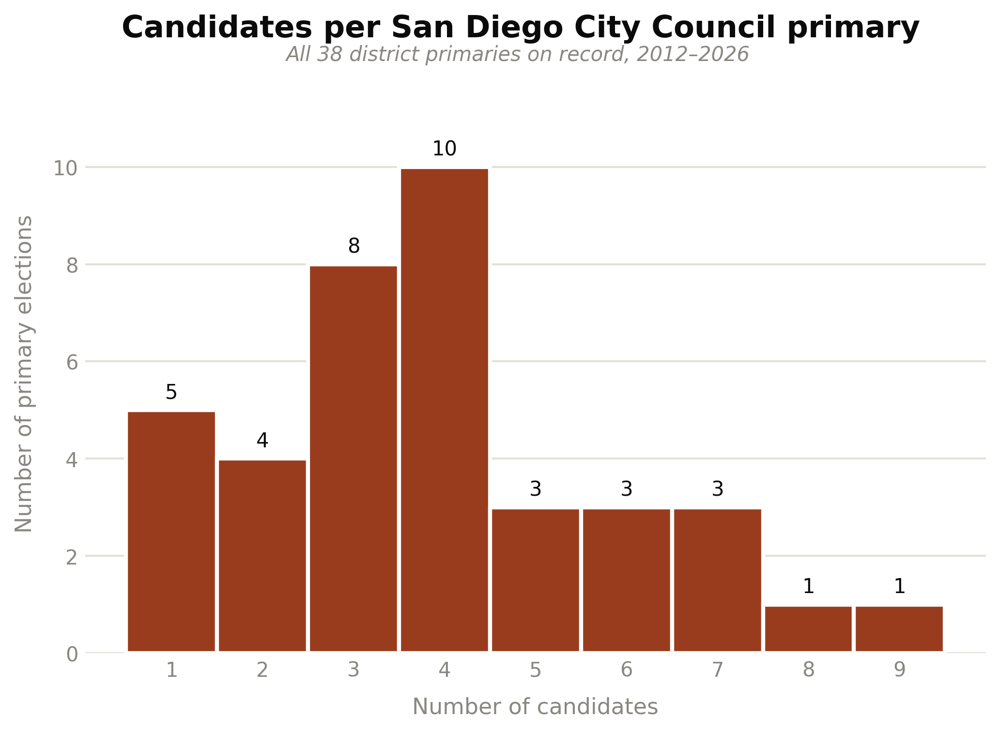

## 3.1 Districting Plan Ensembles

To generate a sufficient number of distinct districting plans, we use GerryChain to run a 10,000-step ReCom chain and subsample 100 plans that will be used in our election simulations. We do this for every set of elections that require a different number of districts.

An ensemble depends only on how many districts a plan has, not on how many seats each district fills, so every configuration sharing a district count draws on the same set of maps — for exapmle, the 3 × 3 and 3 × 5 configurations both use three-district plans and differ only in district magnitude.

Additionally, we run elections where San Diego city is represented as one single district. In these scenarios we don't need to run GerryChain, but we do still perform 100 subsamples. The reason for this is that for all subsampled maps we generate random candidate pools of variable size whose slate composition is roughly proportional to bloc VAP share.

The table below lists every districting configuration used in this study, written as *districts × seats per district*, and the scenarios built on each.

| Configuration | Seats | Ensemble         | Scenarios                                                                               |
| ------------- | ----: | ---------------- | --------------------------------------------------------------------------------------- |
| 1 × 3         |     3 | Single plan      | Hybrid System — 1 × 3 tier                                                              |
| 1 × 6         |     6 | Single plan      | City Charter Amendment Proposal — 1 × 6 tier, both models                               |
| 1 × 9         |     9 | Single plan      | Nine Seats At-Large — both models                                                       |
| 1 × 15        |    15 | Single plan      | Fifteen Seats At-Large STV — both models                                                |
| 3 × 3         |     9 | ReCom, 100 plans | Basic, Truncation, Diverse Preferences, Low Availability, Low Turnout — all both models |
| 3 × 4         |    12 | ReCom, 100 plans | Hybrid System — 3 × 4 tier                                                              |
| 3 × 5         |    15 | ReCom, 100 plans | 3x5 STV (4-bloc); Basic 3 × 5 (2-bloc)                                                  |
| 5 × 3         |    15 | ReCom, 100 plans | 5x3 STV (4-bloc); Basic 5 × 3 (2-bloc)                                                  |
| 9 × 1         |     9 | ReCom, 100 plans | 9 × 1 IRV — both models; 9x1 Plurality (4-bloc); City Charter — 9 × 1 tier              |
| 12 × 1        |    12 | ReCom, 100 plans | 12 × 1 IRV — both models                                                                |
| 15 × 1        |    15 | ReCom, 100 plans | Alternative Electoral Systems — both models                                             |

The two hybrid scenarios — the City Charter Amendment Proposal and the Hybrid System — each pair two configurations in one election, filling part of the body from districts and the rest citywide, so they appear in two rows.

## 3.2 Voter Blocs and Candidate Slates

Mirroring past reports, we consider the largest communities of interest when identifying blocs of voters with shared preferences and slates of candidates with similar policies and positions. In San Diego, much of the attention in redistricting and electoral reform has been focused on communities and voters of color - particularly the Black, AAPI, and Latino communities. We carry that spirit into this report by choosing to focus on these three groups as distinct voting blocs in addition to the "WAIO (White/American Indian/Other Race)" bloc. The decision to merge White, American Indian, and Other Race voters into a single bloc is in keeping with methodological norms of MGGG electoral analysis.

### 3.2.1 Two Bloc vs. Four Bloc Models

In this report, we model voting blocs in two ways. The first is the two-bloc model and has been the standard for this type of electoral analysis in city council elections. In the two-bloc model, we generally designate a bloc for the city-wide majority group (typically White voters) and one for voters of color (POC). Here, our majority group is WAIO and our POC group consists of Black, Latino, and AAPI voters. With the four-bloc model, we provide a more granular view of electoral outcomes for each bloc by modeling them separately. Here we have Black voters (BLK), AAPI voters (AAPI), Latino voters (HIS), and White voters with the additon of Indigigenous American and Other Race voters (WAIO). 

Note that while we attempt to maintain consistency in modeling decisions between the two-bloc and four-bloc siulations, these are fundamentally different approaches in the analysis of electoral systems. For instance, it's possible that the combined POC bloc has enough voter share and crossover support to achieve proportional representation within a given electoral system - and the reader might interpret that all constituent groups within achieve their own share of seats by virtue of belonging to the whole, which is not necessarily true. With the four-bloc approach, we do get to see the outcomes for each bloc individually - with the caveat that each bloc has its own cohesion, turnout, and dirichlet parameters set that changes how crossover and within-slate support functions. Additionally, because we take an "exaggerated proportion" approach to per-slate candidate availability, the stochastic generation of candidates in the overall pool may lead to instances in which votes get split between two minority candidates in such a way that leads to a seat being lost in a particular district. We present this (admittedly contrived) example not as a defintiive explanation of the exact differences between two and four-bloc modeling, but as a point of caution when interpreting and comparing simulated election outcomes between the two.

### 3.2.2 Demographic Table

The voting bloc variables were constructed using Decennial Census variables from 2020 following the [bloc classification methodology](https://data-democracy.org/VAP-CVAP) of MGGG.

The six census categories below partition San Diego's voting-age population of 1,125,087. Every category is assigned to exactly one bloc, so the blocs sum to the whole electorate and no resident is counted twice or left out. The two models place American Indian and other-race voters differently: the two-bloc model counts them with POC, so POC is every voter of colour; the four-bloc model carries them with White voters in WAIO, since they cannot join BLK, HIS or AAPI without picking one arbitrarily.

| Demographic group |           VAP |       Share | Four-bloc | Two-bloc |
| ----------------- | ------------: | ----------: | --------- | -------- |
| White             |       492,810 |      43.80% | WAIO      | WHI      |
| Hispanic          |       298,979 |      26.57% | HIS       | POC      |
| Asian / NHPI      |       229,884 |      20.43% | AAPI      | POC      |
| Black             |        79,988 |       7.11% | BLK       | POC      |
| Other race        |        14,593 |       1.30% | WAIO      | POC      |
| American Indian   |         8,833 |       0.79% | WAIO      | POC      |
| **Total**         | **1,125,087** | **100.00%** |           |          |

Two groupings are used across the study. The **four-bloc model** gives Hispanic, Asian, and Black voters a bloc each alongside WAIO, producing bloc shares of 45.88% WAIO, 26.57% HIS, 20.43% AAPI, and 7.11% BLK. The **two-bloc model** sets White voters alone against everyone else: 43.80% WHI against 56.20% POC. The two models name their White bloc differently on purpose — WHI is White alone, WAIO is White with American Indian and other-race voters folded in — so a label always denotes one population.

The difference is not only one of labels. The four-bloc model needs a cohesion matrix asserting how each minority bloc behaves toward the other two; the two-bloc model asks instead whether a coalition of minority voters can elect candidates of its choice, which is the question these simulations are built around.

## 3.3 Candidate Availability and Pool Size

The decision to simulate candidate availability per-district for each voting bloc relies on evidence found from previous San Diego City council elections. For instance, the last three San Diego City Council Elections had a pattern where candidates representing the Asian and Black community run only in the districts where their own community makes up a larger share of voters across districts ([2020](https://en.wikipedia.org/wiki/2020_San_Diego_elections), [2022](https://en.wikipedia.org/wiki/2022_San_Diego_City_Council_election), [2024](https://en.wikipedia.org/wiki/2024_San_Diego_elections)). Analyzing the bloc distribution of San Diego 9-district plan, District 4 and 6 have the highest shares of Black and Asian communities, respectively, and candidates running in those district are predominantly from those same communitities. Likewise, it is not common to find candidates from Asian and Black running on districts with a low share of their own communities. 

Similarly, evidence suggest that the number of candidate or pool size that runs for each district is not homogenous. Last 14 years of elections, the distribution of candidates running per district is diverse. On primaries, the average number of candidate is 3.89, where there has been districts bellow the mean with only 1 candidate running and districts above, with 9 candidates.

Based on the previous analysis, we determine the pool size and the candidate availability per slate as variables for each district and plan. To calculate our pool size we assume the number of candidates ($m$) behaves as a Binomial Distribution with a floor set as the number of winner per district plus one. The floor $k + 1$ ensures that we never have a scenario where the number of winners is equal to the number of running candidates as they will automatically will declare as winners. 

$$m = k + 1 + x $$

The binomial distribution takes two parameters as inputs: $n$ and $p$.

$$ x ~ \sim \text{Binomial}(n, p)$$

Where:

$k: \text{Number of winners per district}$

$n =  \text{Maximun Number of candidate per district} - \text{Minimun Number of candidate per district} $

$p =  \frac{E(m)-  (k + 1)}{n}$

Finally, we make an assumption that the racial composition of the slate pool will be roughly proportional to that of the VAP in each district. We use the bloc proportions to create an interval, with the intent of sampling candidates of different slates from it. However, before we do we first square each element, normalizing the “squared interval” over the sum of the squared values. This creates an “exaggeration” effect when we sample slate candidates. In other words, if a district has a large Black VAP, it's even more likely that the Black voter-preferred slate of candidates will be larger than the others. Similarly, if the Asian VAP is small it's much less likely that the Asian voter-preferred slate will have many candidates — if any, since we allow for slates to be empty. This is intended to model how community dynamics, segregation, or lack of institutional support may impact candidate availability across geography with respect to race. Finally, we modeled one scenario with a "cubic interval" for sensitivy results to increase the original scenario.

## 3.4 Voter Profile and Ballot Generation

For each district in all 50 district plans of our ensemble, we generate voter preference profiles — a collection of ballots from voters that rank available candidates. These rankings are determined by three of VoteKit's built-in slate ballot generators: Plackett-Luce, Bradley-Terry, and Cambridge Sampler. Plackett-Luce and Bradley-Terry model impulsive voter behavior and deliberative voter behavior respectively, while Cambridge Sampler samples from historical ballot data. Each assumes that each voter bloc has a preference interval for each slate of candidates, along with a tuple of cohesion parameters — one parameter for each slate. All generators feature a two-stage process, and they only differ in how the first stage plays out. 

For PL and BT, before any ballots are drawn each bloc's preference interval is assembled by taking that bloc's cohesion for a given slate and slicing off a sub-interval of that width, then filling it in with the individual candidates of the slate according to their support. We govern the within-slate split with a set of Dirichlet alphas — in this report we hold all alphas at 1, which means that once a voter has decided to reach for a particular slate, every candidate on that slate is treated as equally preferred. The cohesion parameters (the rows of the matrices below) therefore do all the work of ordering slates against one another, while the interval handles the ordering of candidates within a slate. What separates the two models is the story we tell about how a voter walks through that interval to produce a ranking.

Cambridge Sampler functions similarly in its second stage. It's core difference is that the "slate ordering" achieved in the first stage of PL and BT is dictated by sampling from historical voting records from Cambridge, MA elections. 

### The Impulsive Voter

The Plackett-Luce generator builds a ballot from the top down, one position at a time. Starting from the first-place slot, a voter in bloc reaches for a candidate from slate  with probability equal to that bloc's cohesion for the slate, ; whichever slate is chosen then supplies a specific candidate by sampling from that slate's preference interval without replacement. The voter repeats this for the next position, renormalizing over whatever slates still have candidates left, and keeps going until the ballot is full. We call this the impulsive voter because they never look back — each ranking is a snapshot decision made in the moment, with no reconsideration of the choices already committed higher up the ballot. Concretely, a voter picks their favorite, then their next favorite from what remains, and so on, so the probability of a given slate ordering is just the product of these sequential draws.

### The Deliberative Voter

The Bradley-Terry generator instead asks the voter to weigh the ballot as a whole. Rather than filling positions in sequence, the probability of a complete ranking is proportional to the product of the pairwise slate preferences across every pair of slates on the ballot — for a ranking that places slate  above slate , each such head-to-head contributes a factor of . A voter effectively runs every candidate against every other in their head and only then settles on the ordering that is most internally consistent with all of those matchups at once. We call this the deliberative voter, since the ranking reflects a considered comparison of the full field rather than a run of top-down impulses. The candidate-filling stage is identical to Plackett-Luce — once the slate ordering is fixed, specific candidates are drawn from each slate's preference interval — so the two models diverge only in how much of the ballot a voter is imagined to be considering at once.

### The Cambridge Voter

Cambridge Sampler utilizes historical ballot data in the form of Cast Vote Records (CVR) from STV elections in Cambridge, MA. Similar to Slate BT and Slate PL, the voter first makes a weighted coin flip to decide which of two slates they will rank in the first position of their ballot: either a majority or minority candidate. That is, if a voter puts a majorrity candidate first, the rest of their ballot type is sampled in proportion to the number of historical ballots that started with a majority candidate. Once a ballot type is determined, the order of candidates is determined by a PL model. 

> It should be noted that because the Cambridge Sampler voter model is built on historical election data, it only supports two slates of candidates. Therefore, we opt to exclude it from our four-bloc simulations - though it does get included in the two-bloc simulations.

### Cohesion Matrices

Rows are voter blocs, columns are candidate slates; each row sums to 1. A cell is the probability that a voter of that bloc supports a candidate of that slate, so the diagonal is within-group cohesion and the off-diagonal entries describe crossover.

**Two-bloc simulations.**

| bloc ↓ / slate → | WHI | POC |
|---|---|---|
| **WHI** (White) | 0.80 | 0.20 |
| **POC** (Black, Hispanic, Asian/NHPI, American Indian, other race) | 0.11 | 0.89 |

The POC bloc is modelled as slightly more cohesive than WHI — 0.89 against 0.80 — which is what lets it win a share of seats above its share of the modelled electorate in several scenarios, despite lower turnout.

**Four-bloc simulations.**

| bloc ↓ / slate → | WAIO | HIS | AAPI | BLK |
|---|---|---|---|---|
| **WAIO** (White, American Indian, other race) | 0.80 | 0.05 | 0.10 | 0.05 |
| **HIS** (Hispanic) | 0.10 | 0.80 | 0.05 | 0.05 |
| **AAPI** (Asian/NHPI) | 0.15 | 0.03 | 0.80 | 0.02 |
| **BLK** (Black) | 0.05 | 0.10 | 0.05 | 0.80 |

This matrix is used by the Basic scenarios and their variations — Basic 3 × 3, 3 × 5, 5 × 3, Truncation, Diverse Preferences, Low Availability, and Low Turnout. The Alternative Electoral Systems, At-Large, IRV, and City Charter Amendment Proposal scenarios use the same matrix with one row differing: their Hispanic bloc splits its crossover 0.05 to WAIO and 0.10 to BLK, rather than 0.10 and 0.05.

| bloc ↓ / slate → | WAIO | HIS | AAPI | BLK |
|---|---|---|---|---|
| **HIS** (Hispanic) — variant row | 0.05 | 0.80 | 0.05 | 0.10 |

## 3.5 Cambridge Ballot Truncation

The ballots generated in Section 3.4 are, by default, full rankings—every voter ranks every candidate on the slate. However, we introduce a new scenario where voters don't all behave the same way, allowing for incomplete and bullet ballots. We are interested in ballot truncation to measure its impact on minority and majority representation.

It is worth noting that Cambridge has run ranked-choice elections continuously since 1941. Analyzing elections from 2009–2017, we identified a small dispersion in ballot length that varies by community: voters whose first choice was a minority-slate candidate bullet-voted (ranked only one candidate) at a rate of 8.44%, compared to 8.59% for voters whose first choice was a majority-slate candidate. Average ballot length follows a different pattern (5.84 for majority-first ballots versus 6.24 for minority-first ballots). Although these differences are modest, we chose to model the two groups with separate distributions rather than pooling them.

To capture this behavior, we introduce a truncation process calibrated to real ranked-choice ballots from Cambridge, MA's 2009–2017 municipal elections. Using the same structure as VoteKit, we work with two empirical distributions over ballot length: one for ballots that started with a candidate from the historical majority (White) slate, and one for ballots that started with a candidate from the historical minority (Black, Asian, or Hispanic) slate. Finally, the PL and BT preference profiles are truncated to a ballot length uniformly sampled from these empirical distributions.

This process was applied to all scenarios including the Charter Amendment proposal at four and bloc configuration.

## 3.6 Bounded Ballot Truncation

Additionally, this report explores a scenario where voters are not allowed to rank all candidates, but only within a fixed range. To simulate it, we added a variant to the truncation methodology named "Bounded". This methodology subsets the historical Cambridge distribution using a defined lower and upper bound. Using the subset distribution, we sample uniformly to truncates the ballots.

This process was applied to the Charter Amendment proposal, specifically to the 1×9 STV elections and the 3×3 STV elections, to understand its impact on the electoral results. For the 3×3 STV, we defined the range as k to 2k, where k is the number of winners. For the 1×9 STV elections, since the k-to-2k rule does not apply to a single 9-winner district, we instead tested two manually chosen ranges: a bounded range of 6 to 10, and a fixed ballot length of exactly 6.

Additional details of Truncation methodology can be found in the Appendix.

## 3.7 Voting Rules

Elections for each district are simulated using VoteKit's Elections module. We use the following voting rules with the corresponding district configurations:

| Voting Rule | District Configs | Seats/District | Description |
|---|---|---|---|
| **Plurality** | 9 × 1 | 1 (single-winner) | Voters' first choices are tallied and the candidate with the most votes wins outright — no majority required.|
| **IRV** (Instant-Runoff Voting) | 9 × 1 | 1 (single-winner) | The single-winner case of STV: last-place candidates are eliminated round by round and their ballots transferred to the next-ranked choice until one candidate holds a majority. |
| **STV** (Single Transferable Vote) | 3 × 3, 1 × 9 (at-large) | 3 or 9 (multi-winner) | Multi-winner ranked-choice rule using the Droop quota: candidates reaching the quota are elected and their surplus is redistributed, while last-place candidates are eliminated and transferred, until all seats are filled. |

For each system, tiebreaks are performed randomly when needed.
