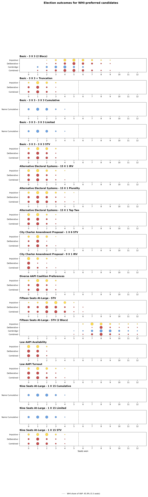

## 4.1 Basic — 3 × 3 (Baseline)

Config: `configs/basic.json`. Three single-member districts, 3 winners, all three 3 × 3 voting rules (Cumulative, STV, Limited), impulsive/deliberative/name-cumulative voter models, 10 replicates.

Against the proportional benchmark of 1.8 of 9 seats (AAPI's 20.4% VAP share), the two score-based rules land closest: pooled across voter models, Cumulative averages 1.47 AAPI seats (10.7% of plans give AAPI zero seats, 47.2% give two or more) and Limited averages 1.44 (11.2% zero, 44.5% two-or-more). STV trails both: 1.10 seats on average, with AAPI shut out entirely in 18.5% of plans and reaching two-or-more only 25.7% of the time. So the choice of counting rule alone — Cumulative/Limited vs. STV, holding district lines and voter behavior fixed — is worth roughly 0.35–0.4 expected seats for the AAPI bloc.

## 4.2 Basic — 3 × 3 + Cambridge Truncation

Config: `configs/basic-truncation.json`. Same 3 × 3 setup as the baseline, but ballots are truncated to a length sampled from the Cambridge, MA 2009–2017 empirical distributions (see [methodology.md § 3.5](methodology.md)) instead of ranking every candidate.

Truncating ballots barely moves STV's AAPI outcomes: mean seats drops slightly from 1.10 (§ 4.1) to 1.07, the zero-seat rate is essentially unchanged (18.5% → 19.0%), and two-or-more actually falls a touch (25.7% → 23.6%) while the one-seat share absorbs the difference (55.8% → 57.4%). Letting voters cast incomplete or bullet ballots, calibrated to real Cambridge data, does not materially change representation here — STV's ranked-elimination process is apparently not very sensitive to how far down the ballot voters bother to rank.

## 4.3 Basic — 100 Profiles per District

Config: `configs/diagnostic/basic_100_reps.json`. Robustness check on the baseline: same 3 × 3 STV setup, but 100 replicate profiles per district instead of 10, to check whether the baseline's results are an artifact of too few replicates.

With 10× the replicate profiles, STV's pooled distribution shifts modestly upward rather than collapsing toward the baseline: mean AAPI seats rises from 1.10 (§ 4.1, 10 reps) to 1.19, the zero-seat rate rises from 18.5% to 23.8%, and the two-or-more rate rises from 25.7% to 32.4% — more mass moves to both tails at the expense of the one-seat outcome (55.8% → 43.8%). The extra replicates widen the spread rather than narrow it, but the order of magnitude and the overall story (STV underperforms the proportional benchmark and the score-based rules) hold up, so the baseline's 10-replicate result isn't a small-sample artifact.

## 4.4 Nine Seats At-Large

Config: `configs/at-large.json`. One district covering the whole city, 9 winners, all three multi-winner rules (Cumulative, STV, Limited).

*Note: this run has no `summary.csv` on disk (only the raw per-district election results and the figures already generated from an earlier pass), so the numbers below are read off the bubble chart rather than recomputed.* All three rules' pooled ("Combined") distributions sit at or below the 1.8-seat proportional line, with their heaviest mass at 1 seat and no plans reaching 3+ seats. Cumulative and Limited look similar to each other. STV stands out for how much it depends on voter behavior: the Impulsive model clears 1–2 seats far more often than Deliberative, pulling STV's own pooled average down toward the same range as the other two rules. So collapsing the city into one 9-seat at-large district doesn't reproduce the Cumulative/Limited-vs-STV gap seen in the 3 × 3 case (§ 4.1) as cleanly — all three land in roughly the same 0–2 seat band here.

*TODO: rerun `pipeline/summarize_results.py` for this config to get exact means/probabilities like the other sections.*

## 4.5 Alternative Electoral Systems — IRV, Plurality, and Two-Round Rules

Config: `configs/alternative_electoral.json`. Nine single-member districts, one winner each, comparing IRV, Plurality, Alaska-style and Top-Two-style two-round rules (see [methodology.md § 3.6](methodology.md)). Also the source of the candidate/slate composition analysis in `notebooks/results_preferences.ipynb`.

Plurality is by far the best rule here for AAPI voters — 0.80 expected seats (out of 9 single-winner districts), with AAPI winning at least one seat 52.1% of the time. Every ranked-elimination or runoff rule does substantially worse: IRV and the built-in Alaska rule both average 0.24 seats (80.4% of districts give AAPI nothing), Top-Two averages 0.31, and this pipeline's custom two-round rules — which resample a fresh profile over the round-1 finalists rather than reusing round-1 ballots — do worse still (AlaskaTwoProfile 0.15, TopTwoTwoProfile 0.18). The mechanism (see `notebooks/results_preferences.ipynb`) is vote-splitting: WHI and HIS often run several candidates in the same district, so an AAPI-preferred candidate can lead on first-choice votes alone, but loses once IRV/runoff elimination consolidates the rest of the field against them. The custom two-round rules compound this because their primary round runs on a lower-turnout electorate (AAPI turnout 75% vs. 100% for WHI/BAIO in the primary) and their round 2 is a fresh sample, not a recount of round-1 ballots — both pull further away from what IRV or a same-profile runoff would have picked.

### Candidate & Slate Composition (supporting analysis)

Across the same run's 900 sampled (plan, district) pairs, candidate pools and active-slate counts vary a lot by design (`pipeline/settings_generator.py::_build_slate_to_candidates` apportions slots by squared local VAP share and can drop a slate to zero). Most districts field only 1–2 slates (29% have exactly 1, 49% have 2, 19% have 3, 2% have 4). WHI is by far the slate most likely to split its own vote — a mean of 3.2 WHI candidates per district, with 2+ WHI candidates in 70% of districts — followed by HIS (mean 1.6, 35% with 2+); AAPI averages 0.85 candidates per district (21% with 2+) and BAIO is rarely present at all (mean 0.17). WHI running multiple candidates against itself so often is exactly the vote-splitting pattern that separates Plurality's AAPI-favorable outcomes from IRV/runoff's in § 4.5.

## 4.6 Low AAPI Turnout

Config: `configs/low-aapi-turnout.json`. Same 3 × 3 STV setup as the baseline, but AAPI turnout is lowered to 50% (vs. 75% elsewhere).

Cutting AAPI turnout from 75% to 50% (all else identical to the baseline STV run in § 4.1) drops mean AAPI seats from 1.10 to 0.95 and nearly doubles the zero-seat rate, from 18.5% to 33.4%; two-or-more falls from 25.7% to 22.9%. Representation under STV is fairly sensitive to turnout on its own — a 25-point turnout gap costs about 0.15 expected seats and pushes AAPI out of representation entirely in one plan out of three.

## 4.7 Low AAPI Availability

Config: `configs/low-aapi-availability.json`. Same 3 × 3 STV setup as the baseline, but the AAPI slate's candidate-availability exaggeration exponent is raised to 3 (vs. 2 for other blocs), modeling scarcer AAPI candidate availability (see [methodology.md § 3.3](methodology.md)'s "cubic interval" sensitivity scenario).

This is the largest swing of any sensitivity scenario. Making AAPI candidates scarcer in low-AAPI-VAP districts (availability exponent 3 vs. 2) nearly halves mean AAPI seats relative to the baseline (1.10 → 0.54), pushes the zero-seat rate from 18.5% to 50.1%, and all but eliminates two-or-more outcomes (25.7% → 4.2%). Whether AAPI candidates run at all — not just how voters rank them or how many turn out — turns out to matter more for AAPI representation than either turnout (§ 4.6) or ballot truncation (§ 4.2).

## 4.8 Diverse AAPI Coalition Preferences

Config: `configs/diverse-preferences.json`. Same 3 × 3 STV setup as the baseline, but the within-slate Dirichlet alpha for AAPI candidates is raised to 2 (vs. 1 elsewhere), spreading AAPI voters' preferences more evenly across their own slate's candidates rather than coalescing behind one front-runner.

Spreading AAPI voters' within-slate preference more evenly barely moves the needle relative to the baseline: mean seats 1.16 vs. 1.10, zero-seat rate 17.0% vs. 18.5%, two-or-more 29.0% vs. 25.7% — all within the range of noise seen between § 4.1 and § 4.3's replicate-count check. Whether AAPI voters coalesce behind one front-runner or split evenly across their own slate's candidates doesn't materially affect how many seats the bloc wins here, since candidates on the same slate are (by construction, per methodology § 3.4) never competing against each other for AAPI votes in a way that costs the slate a win.

## 4.9 Cross-Run Comparison

Ranking every scenario above by mean AAPI seats (proportional benchmark: 1.8 of 9) tells a consistent story about what moves the needle and what doesn't:

| Scenario | Rule | Mean AAPI seats | P(0 seats) | P(2+ seats) |
|---|---|---|---|---|
| Basic — 3 × 3 (§ 4.1) | Cumulative | 1.47 | 10.7% | 47.2% |
| Basic — 3 × 3 (§ 4.1) | Limited | 1.44 | 11.2% | 44.5% |
| Basic — 100 profiles (§ 4.3) | STV | 1.19 | 23.8% | 32.4% |
| Diverse AAPI Coalition Preferences (§ 4.8) | STV | 1.16 | 17.0% | 29.0% |
| Basic — 3 × 3 (§ 4.1) | STV | 1.10 | 18.5% | 25.7% |
| Basic — 3 × 3 + Truncation (§ 4.2) | STV | 1.07 | 19.0% | 23.6% |
| Low AAPI Turnout (§ 4.6) | STV | 0.95 | 33.4% | 22.9% |
| Alternative Electoral Systems (§ 4.5) | Plurality | 0.80 | 47.9% | 20.3% |
| Low AAPI Availability (§ 4.7) | STV | 0.54 | 50.1% | 4.2% |
| Alternative Electoral Systems (§ 4.5) | Top-Two | 0.31 | 74.2% | 4.5% |
| Alternative Electoral Systems (§ 4.5) | IRV / Alaska | 0.24 | 80.4% | 3.5% |
| Alternative Electoral Systems (§ 4.5) | TopTwoTwoProfile | 0.18 | 83.5% | 1.4% |
| Alternative Electoral Systems (§ 4.5) | AlaskaTwoProfile | 0.15 | 86.2% | 1.4% |

Two variables dominate: the **counting rule** (score-based Cumulative/Limited beat STV; among single-winner rules, Plurality beats every ranked-elimination or runoff variant by 2–5×) and **candidate availability** (§ 4.7's scarcity scenario cuts AAPI seats further than any other single change). By contrast, ballot truncation (§ 4.2), extra replicates (§ 4.3), and how unified AAPI voters are within their own slate (§ 4.8) all land within a few hundredths of a seat of the baseline — second-order effects next to the choice of voting rule and who's on the ballot in the first place. Nine Seats At-Large (§ 4.4) isn't in this table since it has no `summary.csv` to aggregate, but its bubble chart shows all three rules clustered in the same 0–2 seat band, well below the proportional line.
